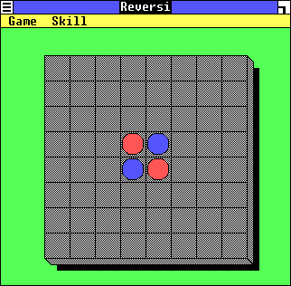
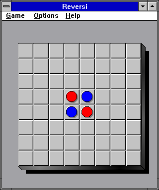

# Reversi
Reversi for Windows 10, Comes with WineVdm and RLauncher. 

Made possible with the help of <a href="github.com/otya128/winevdm/">WineVDM</a>
 
RLauncher is a Java Program made by me as a GUI for WineVDM
<H2>RLauncher</H2>
<h4>RLauncher Gives You Two Versions of Reversi</h4>
<h6>The Original Reversi (Included in Windows 1.x, 2.x, 3.0)</h6>

<h6>The Updated Reversi (Included in Driver Pack for Windows 3.1)</h6>

<h2>Installation</h2>
Download the Zip File
 
Move ".reversi" to C:/
 
Unzip it
 
Run RLauncher.exe or RLauncher.jar
 
Happy REVERSIng!
<h1>AND CAN YOU BELIEVE IT?!</H1>

<H1>REVERSI</H1>
